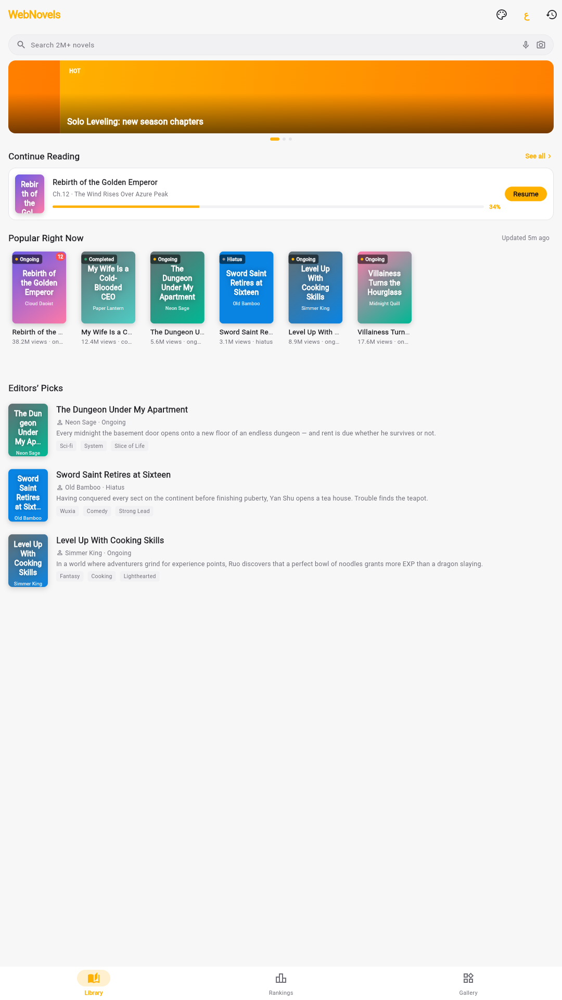
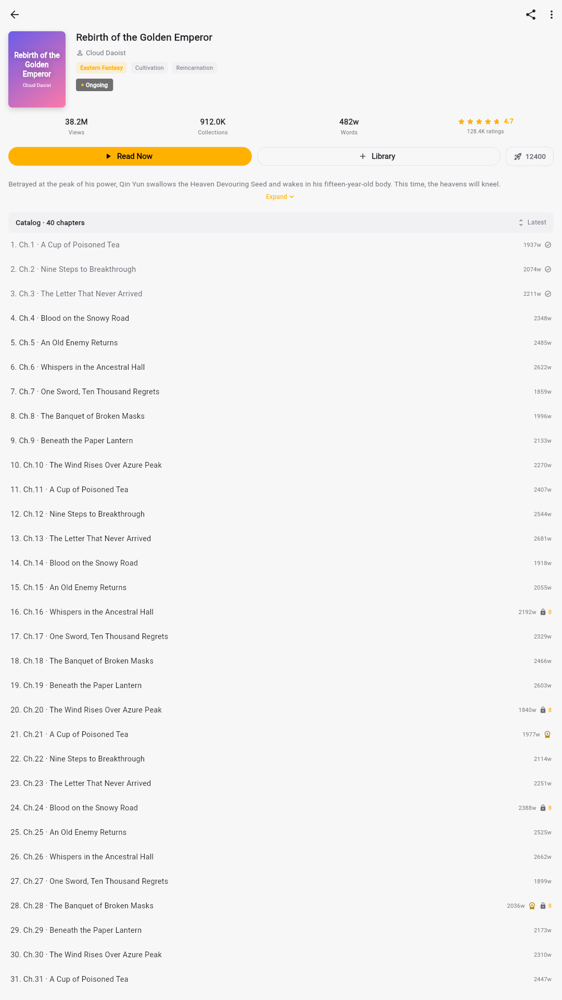
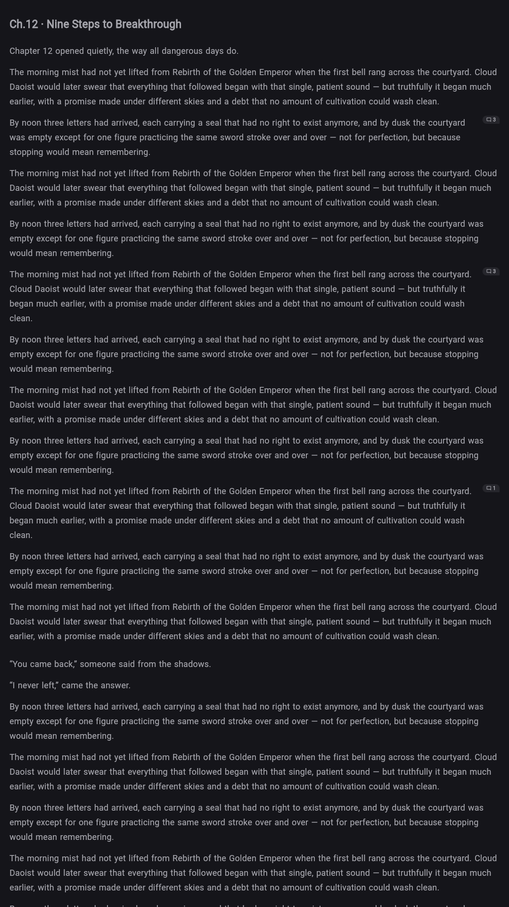
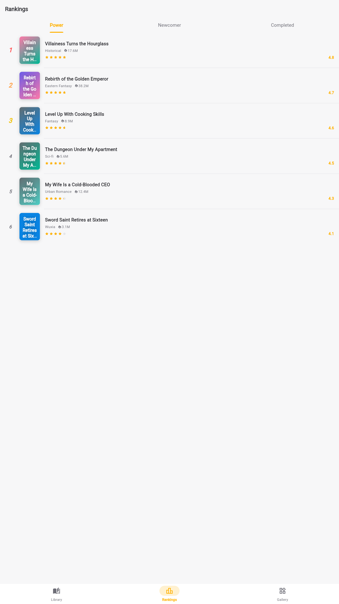
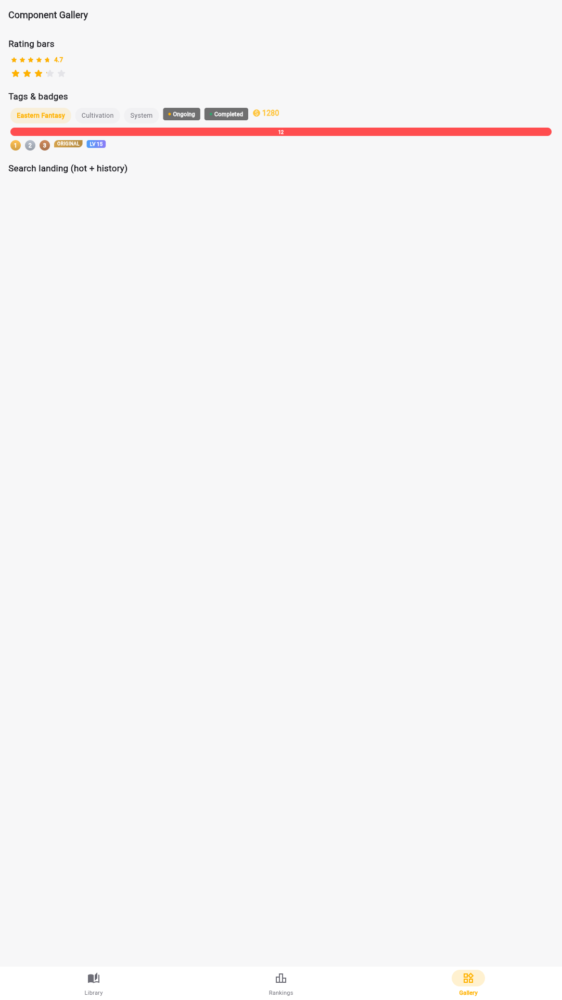
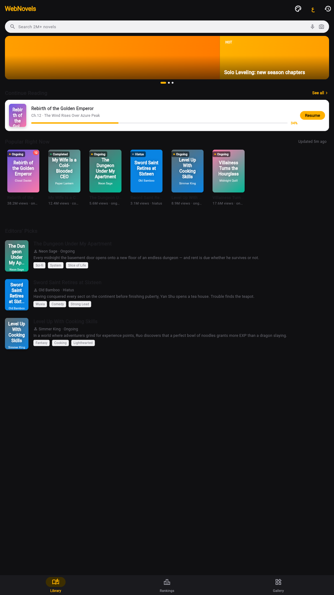

<div align="center">

# novel_ui

**A novel-app design system for Flutter** — build reading apps with
Webnovel-grade UI: book grids, rankings, chapter catalogs with coin
unlocks, and a complete reading engine.

[](https://pub.dev/packages/novel_ui)
[](https://pub.dev/packages/novel_ui/score)
[](https://pub.dev/packages/novel_ui)
[](LICENSE)

[Library](#-screenshots) · [Quick start](#-quick-start) · [Reader](#-the-reader) · [Theming](#-theming) · [Arabic / RTL](#-arabic--rtl)





</div>

---

## ✨ Why novel_ui

- **A reading engine, not just widgets** — true pagination measured with
  `TextPainter` (page breaks land exactly where they render), scroll mode,
  auto-scroll, three page-turn styles, six paper themes.
- **Recovered from the real thing** — reader papers, unlock flows, podium
  rankings, review axes and comment specs follow the official Webnovel
  app's own values (extracted from its shipped resources).
- **Monetization built in** — locked/VIP chapter tiles, coin unlock sheet,
  wait-or-pay countdown, power-stone votes.
- **Arabic & RTL are first-class** — every label ships in EN + AR through
  the theme; one line flips the whole app.
- **Zero dependencies** — pure Flutter, all six platforms, WCAG-AA contrast
  verified programmatically across every theme.

## 🚀 Quick start

```yaml
dependencies:
  novel_ui: ^0.4.0
```

```dart
import 'package:novel_ui/novel_ui.dart';

MaterialApp(
  theme: NovelThemeData.webnovel().toMaterialTheme(),      // official blue
  darkTheme: NovelThemeData.dark().toMaterialTheme(),
  builder: (context, child) => NovelTheme(
    data: NovelTheme.of(context),
    child: child!,
  ),
)
```

## 📸 Screenshots

| | | |
|---|---|---|
|  |  |  |
| *Rankings* | *Component gallery* | *Dark mode* |

## 📚 What's inside

| Area | Components |
|---|---|
| **Books** | `NovelBookCard` (grid / `.rail` / `.row`), `NovelCoverView` (auto-generated covers), `NovelContinueReadingCard`, `NovelStatusBadge`, `NovelTagChip` |
| **Discovery** | `NovelBannerCarousel`, `NovelSearchField`, `NovelSearchSuggestions`, `NovelRankListItem`, `NovelPowerRankPodium`, `NovelLatestUpdateTile`, `NovelSectionHeader` |
| **Catalog & coins** | `NovelChapterTile`, `NovelUnlockSheet`, `NovelCoinBadge`, `NovelWaitOrPayTile`, `NovelPowerStoneButton`, `NovelReadingListPicker` |
| **Engagement** | `NovelRatingBar`, `NovelReviewAxes`, `NovelCommentTile`, `NovelFansRankBadge`, `NovelAchievementRow`, `NovelLevelBadge` |
| **Reader** | `NovelReaderView`, `NovelTextPaginator`, `NovelParagraphCommentsSheet`, `NovelFontManager`, `NovelTtsPanel`, `NovelDanmakuOverlay` |

## 🔤 The reader

```dart
NovelReaderView(
  chapter: chapter,
  totalChapters: chapters.length,
  settings: const NovelReaderSettings(paper: NovelReaderPaper.sepia),
  paragraphCommentCounts: {2: 12, 7: 3},          // numbered bubbles
  onParagraphComments: (i) => NovelParagraphCommentsSheet.show(
    context, paragraphIndex: i,
    paragraphText: chapter.paragraphs[i],
    comments: repo.commentsFor(chapter, i),
  ),
  onProgressChanged: (p) => repo.saveProgress(book.id, p),
  onPrevChapter: loadPrev,
  onNextChapter: loadNext,
)
```

Six paper themes (white · parchment · mint · gray · kraft · night), font
size 12–32, line-height and paragraph-gap sliders, auto-scroll, and three
page-turn animations — all user-tunable from the built-in settings sheet.

## 🎨 Theming

Every visual value resolves `widget.field ?? componentTheme.field ??
default`, so restyling is one place:

```dart
NovelThemeData.webnovel().copyWith(
  components: NovelComponentsTheme().copyWith(
    bookCard: const NovelBookCardTheme(titleStyle: TextStyle(fontSize: 15)),
  ),
)
```

Or match a famous platform instantly:

```dart
NovelThemeData(colorScheme: NovelPlatformPresets.wattpad(context))
```

## 🌍 Arabic & RTL

```dart
NovelThemeData.webnovel().copyWith(strings: NovelStrings.ar())
// + Directionality(textDirection: TextDirection.rtl)
```

## 🧪 Quality

28 tests including alchemist golden suites (light/dark × LTR/RTL),
paginator engine edge cases, and programmatic WCAG-AA contrast checks over
every theme. `dart doc` clean; pub.dev score **160/160**.

## 📄 License

MIT — see [LICENSE](LICENSE).
